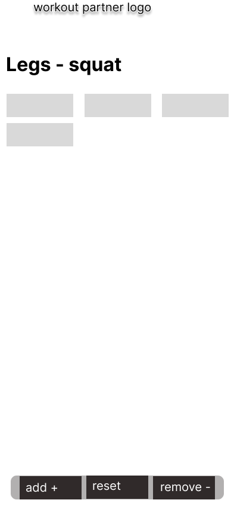
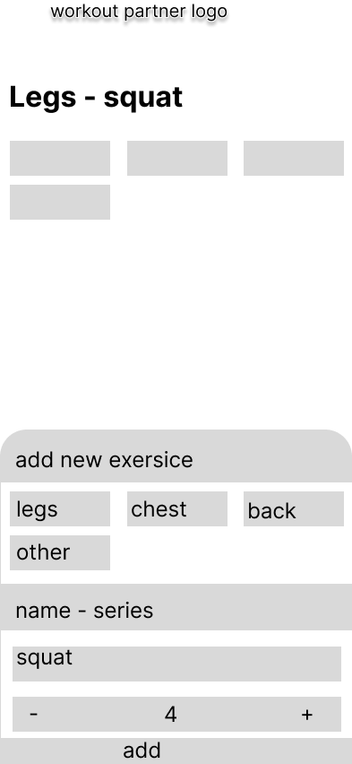

# Workout Partner

## Introducción:

* **Descripción general:**
    * "Workout Partner" es una aplicación web diseñada para ayudar a personas principiantes, individuos con TDAH y cualquier persona que busque simplificar el seguimiento de sus rutinas de ejercicio. La aplicación se centra en la gestión de series y repeticiones, permitiendo a los usuarios estructurar sus rutinas personalizadas y visualizar su progreso.
* **Público objetivo:**
    * Principiantes en el ejercicio.
    * Personas con TDAH que necesitan una herramienta para mantener el enfoque durante sus rutinas.
    * Usuarios que desean delegar el seguimiento de series y repeticiones para concentrarse en la ejecución de los ejercicios.
* **Objetivos:**
    * Proporcionar una herramienta intuitiva y sencilla para el seguimiento de rutinas de ejercicio.
    * Facilitar la creación y personalización de rutinas.
    * Ayudar a los usuarios a visualizar su progreso y mantener la motivación.
    * Proporcionar imagenes ilustrativas para ayudar a identificar los grupos musculares.

# Workout Partner

## Introducción:

* **Descripción general:**
    * "Workout Partner" es una aplicación web diseñada para ayudar a personas principiantes, individuos con TDAH y cualquier persona que busque simplificar el seguimiento de sus rutinas de ejercicio. La aplicación se centra en la gestión de series y repeticiones, permitiendo a los usuarios estructurar sus rutinas personalizadas y visualizar su progreso.
* **Público objetivo:**
    * Principiantes en el ejercicio.
    * Personas con TDAH que necesitan una herramienta para mantener el enfoque durante sus rutinas.
    * Usuarios que desean delegar el seguimiento de series y repeticiones para concentrarse en la ejecución de los ejercicios.
* **Objetivos:**
    * Proporcionar una herramienta intuitiva y sencilla para el seguimiento de rutinas de ejercicio.
    * Facilitar la creación y personalización de rutinas.
    * Ayudar a los usuarios a visualizar su progreso y mantener la motivación.
    * Proporcionar imagenes ilustrativas para ayudar a identificar los grupos musculares.

## Funcionalidades Principales:

* **Seguimiento de series y repeticiones:**
    * El usuario podrá registrar el número de repeticiones y el peso utilizado en cada serie de un ejercicio.
    * La aplicación mostrará un historial de las series realizadas para cada ejercicio.
* **Estructuración de rutinas personalizadas:**
    * El usuario podrá crear rutinas personalizadas, añadiendo ejercicios y definiendo el número de series y repeticiones.
    * La aplicación permitirá organizar los ejercicios por grupos musculares o por días de la semana.
* **Visualización del progreso:**
    * La aplicación mostrará un resumen del progreso del usuario a lo largo de la rutina.
    * Se podrán visualizar gráficos o tablas con el historial de ejercicios y el progreso en el tiempo.
* **Imagenes ilustrativas.**
    * Cada ejercicio tendra una imagen que ilustre los grupos musculares que se trabajan.

## Diseño de la Interfaz de Usuario (UI):

* **Enfoque:**
    * Sencillo e intuitivo, con una interfaz limpia y fácil de usar.
    * Diseño responsivo para adaptarse a diferentes tamaños de pantalla.
    * Uso de imágenes ilustrativas para facilitar la identificación de los ejercicios.
* **Elementos clave:**
    * Pantalla principal con la rutina del día o la opción de seleccionar una rutina.
    * Pantalla de registro de series y repeticiones con campos claros y botones grandes.
    * Pantalla de historial de ejercicios con gráficos y tablas de progreso.
    * Pantalla para la creación de rutinas, donde se pueda buscar los ejercicios por nombre o grupo muscular.
* **Guía de estilo:**
    * Colores: Se utilizará una paleta de colores neutros y agradables, con un color principal que transmita energía y motivación.
    * Tipografía: Se utilizará una fuente legible y clara, adecuada para la lectura en pantalla.
    * Imagenes: se usaran imagenes que definan de manera clara los grupos musculares que se trabajan.

## Arquitectura Técnica:

* **Plataforma:**
    * Aplicación web.
* **Tecnologías:**
    * HTML, CSS, JavaScript.
    * Posible uso de un framework de JavaScript (React, Vue, Angular) para facilitar el desarrollo y mantenimiento.
    * Para el almacenamiento local se usara "Local storage" del navegador.
* **Modelo de datos:**
    * Se definirá un modelo de datos sencillo para almacenar la información de los usuarios, rutinas, ejercicios y series.

## Almacenamiento de Datos:

* **Método:**
    * Almacenamiento local en el navegador utilizando localStorage.
* **Consideraciones:**
    * Al ser almacenamiento local, los datos no se sincronizarán entre diferentes dispositivos.
    * Se informará al usuario sobre las limitaciones del almacenamiento local.

## Próximos pasos:

* Desarrollar esquemas detallados de las pantallas principales.
* Definir el modelo de datos.
* Seleccionar las tecnologías y herramientas de desarrollo.
